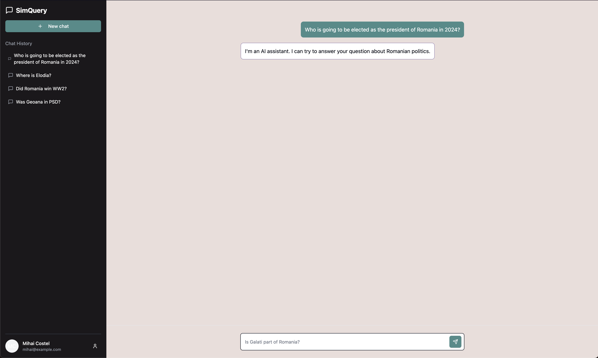

# SimQuery

**SimQuery** is a Next.js-based AI application for validating data about Romanian political history. It cross-references and verifies data points like historical events, political figures, and key dates, ensuring accuracy and reliability for research and educational purposes.



---

## Project Overview

SimQuery provides tools to validate data related to Romania’s political history, using AI to analyze and cross-reference input data with known historical records. Built with Next.js, SimQuery is optimized for fast, seamless interactions and accurate validation results.

---

## Features

- **Historical Event Validation**: Verifies dates, events, and political figures in Romanian history.
- **Cross-Referencing**: Cross-references data points with a verified historical database.
- **Easy-to-Use Interface**: Built with Next.js for a smooth, responsive user experience.

---

## Installation

You can either use the deployed version of **SimQuery** or run it locally on your machine.

The deployed version is currently available [here](https://turbo-bassoon-lime.vercel.app.vercel.app/).

If you want to clone and run the project locally, follow these steps:

1. Clone the repository: https://github.com/mirceamaierean/turbo-bassoon

2. Install dependencies:

   ```bash
   npm install
   ```

3. Run the development server:

   ```bash
   npm run dev
   ```

   Open [http://localhost:3000](http://localhost:3000) to view it in your browser.

---

## Usage

To start using **SimQuery**, upload or enter data about Romanian political history for validation. Results will show validated data points and any discrepancies found. Any query you want will be processed and validated in real-time.

As an answer to your query, you will receive a list of validated data points, along with any discrepancies found. You can then use this information for research, educational purposes, or any other relevant context.

---

Enjoy using **SimQuery** to validate your historical data accurately and efficiently!
